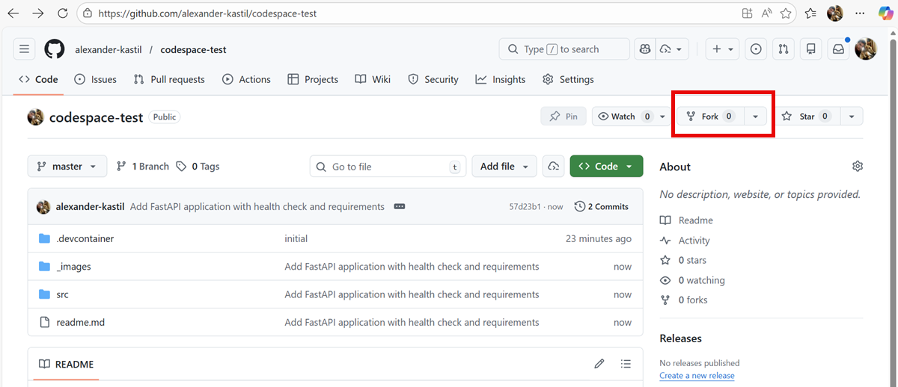
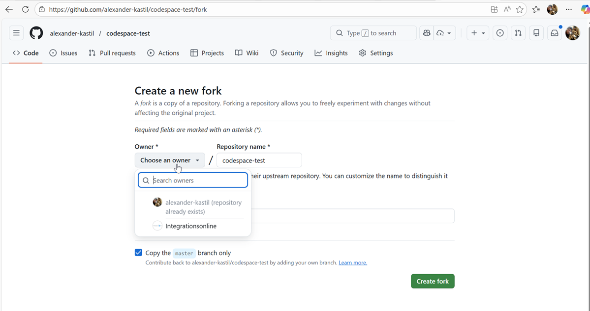
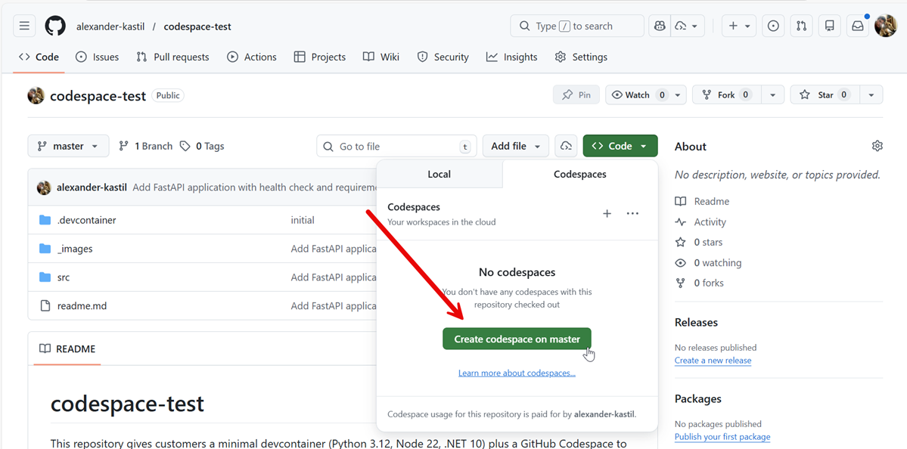

# codespace-test

This repository gives customers a minimal devcontainer (Python 3.12, Node 22, .NET 10) plus a GitHub Codespace to validate proxy behavior, port forwarding, and package downloads. Use it to confirm that outbound calls (pip/npm/nuget) and forwarded ports work end-to-end before onboarding larger projects.

Forking and starting a Codespace (visual guide):

- Fork the repo (top right) to your org/user. 
- Pick the fork owner/org and confirm. 
- In your fork, open Code ➜ Codespaces ➜ Create codespace on master to launch the devcontainer. 

Then verify tools and proxy, and run the bundled tester:

- In the Codespace terminal: `python --version`, `node -v`, `dotnet --info` (proxy/tool check).
- Install quick packages to confirm downloads: `pip install httpx` and `npm install left-pad`.
- Set up the tester app:
  ```bash
  cd src/python-tester
  python -m venv .venv
  source .venv/bin/activate  # Windows: .venv\Scripts\activate
  pip install -r requirements.txt
  uvicorn app:app --host 0.0.0.0 --port 8000
  ```
- Forward port 8000 when prompted.
- Use [src/python-tester/test-rest-call.http](src/python-tester/test-rest-call.http) to hit `/` and `/health` via the forwarded URL (validates proxyed downloads + port forwarding).

If anything fails (timeouts, 407, no forwarded URL), copy the error text so we can troubleshoot quickly.
