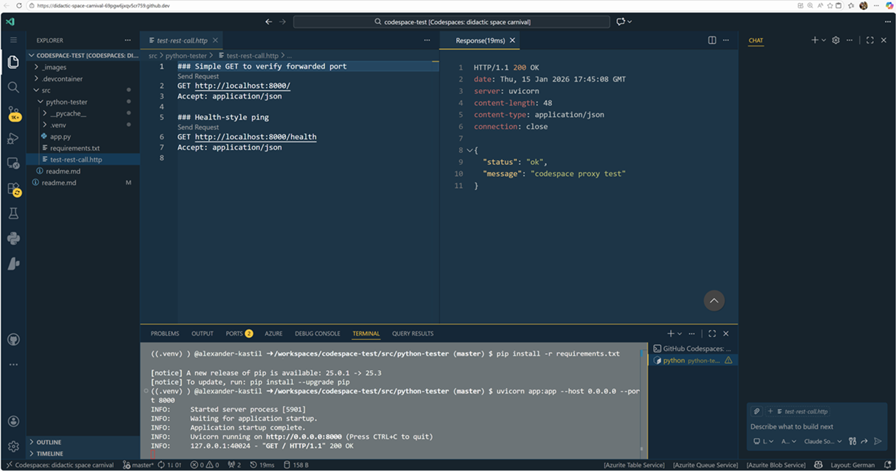

# Test Package Management and Port Forwarding in Codespaces

- Set up the tester app:

  ```bash
  cd src/python-tester
  python -m venv .venv
  source .venv/bin/activate
  pip install -r requirements.txt
  uvicorn app:app --host 0.0.0.0 --port 8000
  ```

- Forward port 8000 when prompted.
- Use [src/python-tester/test-rest-call.http](src/python-tester/test-rest-call.http) to hit `/` via `Send Request`

  
